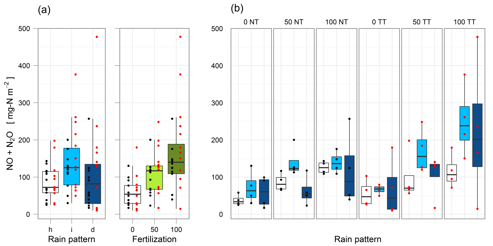

```{r, echo=F}
data <- copy(RAWdata)

data[,.(
        mean.NO.N2O = mean(NO.N2O, na.rm=T),
        sd.NO.N2O = sd(NO.N2O, na.rm=T),
        se.NO.N2O = sd(NO.N2O, na.rm=T)/log(sum(!is.na(NO.N2O))),
        count.NO.N2O = sum(!is.na(NO.N2O))
), by=fertilization]

data[,.(
        mean.NO.N2O = mean(NO.N2O, na.rm=T),
        sd.NO.N2O = sd(NO.N2O, na.rm=T),
        se.NO.N2O = sd(NO.N2O, na.rm=T)/log(sum(!is.na(NO.N2O))),
        count.NO.N2O = sum(!is.na(NO.N2O))
), by=precipitation]

data[,.(
        mean.NO.N2O = mean(NO.N2O, na.rm=T),
        sd.NO.N2O = sd(NO.N2O, na.rm=T),
        se.NO.N2O = sd(NO.N2O, na.rm=T)/log(sum(!is.na(NO.N2O))),
        count.NO.N2O = sum(!is.na(NO.N2O))
), by=tillage]

# data[,.(
#         mean.NO.N2O = mean(NO.N2O, na.rm=T),
#         sd.NO.N2O = sd(NO.N2O, na.rm=T),
#         se.NO.N2O = sd(NO.N2O, na.rm=T)/log(sum(!is.na(NO.N2O))),
#         count.NO.N2O = sum(!is.na(NO.N2O))
# ), by=.(fertilization, precipitation, tillage)]

data[,.(
        mean.NO.N2O = mean(NO.N2O, na.rm=T),
        sd.NO.N2O = sd(NO.N2O, na.rm=T),
        se.NO.N2O = sd(NO.N2O, na.rm=T)/log(sum(!is.na(NO.N2O))),
        count.NO.N2O = sum(!is.na(NO.N2O))
), by=incubation]

par(mfrow=c(1,4))
with(data, boxplot(log(NO.N2O) ~ fertilization, main = "fertilization"))
with(data, boxplot(log(NO.N2O) ~ precipitation, main = "precipitation"))
with(data, boxplot(log(NO.N2O) ~ tillage, main = "tillage"))
with(data, boxplot(log(NO.N2O) ~ incubation, main = "incubation"))


par(mfrow=c(1,4))
ggplot(data=data, aes(x=fertilization, y=NO.N2O)) + 
        geom_point(size=3, color="darkgrey", alpha=0.5) +
        theme_bw()
ggplot(data=data, aes(x=precipitation, y=NO.N2O)) + 
        geom_point(size=3, color="darkgrey", alpha=0.5) +
        theme_bw()
ggplot(data=data, aes(x=tillage, y=NO.N2O)) + 
        geom_point(size=3, color="darkgrey", alpha=0.5) +
        theme_bw()
ggplot(data=data, aes(x=incubation, y=NO.N2O)) + 
        geom_point(size=3, color="darkgrey", alpha=0.5) +
        theme_bw()

```



# 0 conclusions

<span style="color:red">

</span>

# 1 factorial ANOVA
## a. Define the models
### a.1. parametric models

```{r, echo=F}
# replace strings:
# 1. "NO.N2O ~" --> "transformation ~"
# 2. "[,NO.N2O]" --> "[,transformation]"
```

```{r}
fit <- lm(log(NO.N2O) ~ fertilization + precipitation , data=data)
fit.aov <- aov(log(NO.N2O) ~ fertilization + precipitation , data=data)
fit.aov.int <- aov(log(NO.N2O) ~ (fertilization + precipitation )^2, data=data)

# factor removal; for later model comparison
fit1 <- lm(log(NO.N2O) ~  precipitation , data=data)
fit2 <- lm(log(NO.N2O) ~  fertilization , data=data)
fit3 <- lm(log(NO.N2O) ~  fertilization + precipitation, data=data)

fit.int <- lm(log(NO.N2O) ~ ( fertilization + precipitation )^2, data=data)

# summary(fit)
summary(fit.aov)

# model with interactions
summary(fit.aov.int)
```

### a.2. Non-parametric models

```{r, echo=F}
# replace strings:
# 1. "N2O ~" --> "transformation ~"
# 2. "[,N2O]" --> "[,transformation]"
```

```{r}
fit.p <- lmp(log(NO.N2O) ~  fertilization + precipitation , data=data)
fit.aovp <- aovp(log(NO.N2O) ~  fertilization + precipitation , data=data)
fit.aovp.int <- aovp(log(NO.N2O) ~ ( fertilization + precipitation )^2, data=data)

# factor removal; for later model comparison
fit1.p <- lmp(log(NO.N2O) ~  precipitation , data=data)
fit2.p <- lmp(log(NO.N2O) ~  fertilization , data=data)
fit3.p <- lmp(log(NO.N2O) ~  fertilization + precipitation, data=data)

fit.int.p <- lmp(log(NO.N2O) ~ ( fertilization + precipitation )^2, data=data)

# summary(fit)
summary(fit.aovp)

# model with interactions
summary(fit.aovp.int)
```

## b.Regression diagnostics (parametric model)
### b.1 (base package) plotting fit
```{r}
################################################################################
# {base}
par(mfrow=c(2,2))
plot(fit)
title(paste(fit$call[2]), outer=T, line = -2)
```

### b.2 (car package)
#### NORMALITY

```{r}
################################################################################
### {car} package

# 
# NORMALITY
par(mfrow=c(1,1))
# qqPlot(fit, labels=data$id, simulate=TRUE, main="Q-Q Plot", id.method="identify")
# qqPlot(fit, labels=rownames(data), simulate=TRUE, main=paste("Q-Q Plot \n",fit$cal[2]), id.method="identify")
qqPlot(fit, labels=rownames(data), simulate=TRUE, main=paste("Q-Q Plot \n",fit$cal[2]), id.method="y", id.n = 2)
```

```{r echo=FALSE}
### create residual plot function

#
residplot <- function(fit, nbreaks=18) {
        z <- rstudent(fit)
        hist(z, breaks=nbreaks, freq=FALSE,
             xlab="Studentized Residual",
             main=paste("Distribution of Errors \n",fit$cal[2]))
        rug(jitter(z), col="brown")
        curve(dnorm(x, mean=mean(z), sd=sd(z)),
              add=TRUE, col="blue", lwd=2)
        lines(density(z)$x, density(z)$y,
              col="red", lwd=2, lty=2)
        legend("topright",
               legend = c( "Normal Curve", "Kernel Density Curve"),
               lty=1:2, col=c("blue","red"), cex=.7)
}
```


```{r}
residplot(fit)
```

#### INDEPENDENCE OF ERRORS (autocorrelation)
```{r}
# 
# INDEPENDENCE OF ERRORS (autocorrelation) 
# independence (it might be of interest to check whether ther is any autocorrelation regarding chronological sampling order whitin one incubation)
# no sense as it is test here, but nevertheless ...

# lag ==1 (observation compared with next one; not in chrono order though)
durbinWatsonTest(fit)
```


#### LINEARITY (systematic departure from the linear model ?)
```{r}
# 
# LINEARITY (might not have sense for categorical indep variables)
# If the dependent variable is linearly related to the independent variables, there should be no systematic relationship between the residuals and the predicted (that is, fitted) values.
# crPlots(fit, main = paste(fit$call[2]))
```

#### HOMOSCEDASTICITY (non-constant error variance)
```{r}
# 
# HOMOSCEDASTICITY
# ncvTest() function: produces a score test of the hypothesis of constant error variance against the alternative that the error variance changes with the level of the  fitted  values.  A  significant  result  suggests  heteroscedasticity  (nonconstant  error variance).

ncvTest(fit); spreadLevelPlot(fit, main = paste(fit$call[2]))
```


### b.3 Global validation of linear model; gvlma() function in the gvlma package
```{r}
# Global validation of linear model; gvlma() function in the gvlma package
require(gvlma)

gvmodel <- gvlma(fit)
summary(gvmodel)
# 
# # outlier removed
# myfit <- lm(log(NO.N2O) ~ fertilization + precipitation , data=data[-c(6, 48,66)])
# gvmodel <- gvlma(myfit)
# summary(gvmodel)
# ```

### b.4 Multicollinearity ( vif() function in the car package )
```

```{r}
# 
# MULTICOLLINEARITY

# two or more predictor variables in a multiple regression model are highly correlated, meaning that one can be linearly predicted from the others

# not directly related to statistical assumptions; but important in allowing to interpret multiple regression results

# detected using a statistic called the variance inflation factor (VIF). For any predictor variable, the square root of the VIF indicates the degree to which the confidence interval for that variable’s regression parameter is expanded relative to a model with uncorrelated predictors. As a general rule, log(vif) > 2   indicates a multicollinearity problem.

vif(fit); log(vif(fit)) > 2 # problem?
```


## c. unusual observations
#### c.1 outliers 
```{r}
## outliers (outlierTest() function in {car})

outlierTest(fit)

# next.outlier <- lmp(log(NO.N2O) ~ fertilization + precipitation , data=data[-c(66)]) 
# outlierTest(next.outlier)
# 
# next.outlier <- lmp(log(NO.N2O) ~ fertilization + precipitation , data=data[-c(48,66)]) 
# outlierTest(next.outlier)
# 
# next.outlier <- lmp(log(NO.N2O) ~ fertilization + precipitation , data=data[-c(6, 48,66)]) 
# outlierTest(next.outlier)
# next.outlier <- lmp(log(NO.N2O) ~ fertilization + precipitation , data=data[-c(68,54)]) # only 17 is an outlier
# outlierTest(next.outlier)
# 
# 
# # identify outliers
# myoutliers <- c(68,54)
# data[myoutliers, .(id, NO.N2O, CO2.1.3, NO.N2O, CO2.1.3)]
# 
# data[myoutliers, NO]; fitted(fit)[myoutliers]
# residuals(fit)[myoutliers]; rstudent(fit)[c()]
```

#### c.2 Influential observations
##### **c.23.1 Cook's distance (D statistic)**
```{r}
 # Cook s D values greater than 4/(n – k – 1), where n is the sample size and k is the number of predictor variables, indicate influential observations. D > 1 is more commonly used

cutoff <- 4/(nrow(data)-length(fit$coefficients)-2)
plot(fit, which=4, cook.levels=cutoff)
abline(h=cutoff, lty=2, col="red")
title("influential observations", outer=T, line = -2)
```

##### **c.2.2 Added variance plots** (how do they influence?)
```{r}
avPlots(fit, ask=FALSE, id.method="y", id.n = 2, labels=rownames(data))
```

##### **c.2.3 Influential plots**
```{r}
# not relevant for factorial categorical design

# influencePlot(fit, id.n = 2, labels=rownames(data),
#               main=paste("Influence Plot \n",fit$cal[2]),
#               sub="Circle size is proportional to Cook's distance")

```


## d. Corrective measures
(if some of the assumptions are not met)

### d.1. Deleting observations
### d.2. Transforming variables

```{r}
################################################################################
### normality; powerTransform() function in {car}
################################################################################

# maximum-likelihood estimation of the power λ most likely to normalize the variable X ^ λ
# check null hypothesis λ = 1

summary(powerTransform(data[,log(NO.N2O)]+1))
```

<span style="color:red">
--> 
</span>

```{r}
################################################################################
### linearity
################################################################################
# boxTidwell(log(NO.N2O) ~ fertilization + precipitation , data=data)
# no sense for categorical predictors

################################################################################
### heteroscedasticity
################################################################################

# already checked before
```

### d.3. Adding or deleting variables
check multicolinearity

### d.4. Using another regression approach


## e. Selecting the 'best' regression model
accuracy vs parsimony

### parametric model

### e.1 Comparing models
#### * Comparing nested models using the anova() function
```{r}
anova(fit, fit1)
anova(fit, fit2)
anova(fit, fit3)
```

<span style="color:red">

</span>

#### * Akaike Information Criterion (AIC)
```{r}
# The  index  takes  into  account  a  model’s  statistical  fit  and  the  number  of parameters needed to achieve this fit. Models with smaller AIC values—indicating adequate fit with fewer parameters—are preferred
# do not need for nested models as the previous approach does
AIC(fit,fit1)
AIC(fit,fit2)
AIC(fit,fit3)
```

<span style="color:red">

</span>

### e.2 Variable selection
#### STEPWISE REGRESSION
```{r}
 # stepAIC() function in the MASS package performs stepwise model selection (forward, backward, or stepwise) using an exact AIC criterion
# there’s no guarantee that it will find the “best” model
library(MASS)
stepAIC(fit.int, direction="backward")
```

<span style="color:red">
-->
</span>

#### ALL SUBSETS REGRESSION
```{r}
library(leaps)
leaps <-regsubsets(log(NO.N2O) ~ ( fertilization + precipitation ), data=data, nbest=4)
plot(leaps, scale="adjr2")
# subsets(leaps, statistic="cp", 
#         main="Cp Plot for All Subsets Regression")
# abline(1,1,lty=2,col="red")
```

<span style="color:red">
-->
</span>

### non-parametric model

#### STEPWISE REGRESSION
```{r}
 # stepAIC() function in the MASS package performs stepwise model selection (forward, backward, or stepwise) using an exact AIC criterion
# there’s no guarantee that it will find the “best” model
library(MASS)
stepAIC(fit.int.p, direction="backward")
```


### e.3 Cross validation
bootstaping approach (for numerical predictors only, I assume)
```{r, echo = F}
shrinkage <- function(fit, k=4){
  require(bootstrap)
  theta.fit <- function(x,y){lsfit(x,y)}                     
  theta.predict <- function(fit,x){cbind(1,x)%*%fit$coef}     
  x <- fit$model[,2:ncol(fit$model)]                         
  y <- fit$model[,1]                                         
  results <- crossval(x, y, theta.fit, theta.predict, ngroup=k)  
  r2 <- cor(y, fit$fitted.values)^2                         
  r2cv <- cor(y, results$cv.fit)^2                            
  cat("Original R-square =", r2, "\n")
  cat(k, "Fold Cross-Validated R-square =", r2cv, "\n")
  cat("Change =", r2-r2cv, "\n")
}

 # shrinkage(fit)
```

### e.4 Relative importance (of predictors)
(for numerical predictors only)
```{r, echo =F}
# see "R in action 2nd ed." book
```

# 2 Multiple comparison
## post-hoc  comparisons (Tukey) for parametric model

```{r, echo=F}
TukeyHSD(fit.aov)

par(mfrow= c(1,3),mar=c(5,4,6,2))
par(las=1)

tuk <- glht(fit.aov, linfct=mcp(fertilization="Tukey"))
plot(cld(tuk, level=.05),col="lightgrey")

tuk <- glht(fit.aov, linfct=mcp(precipitation="Tukey"))
plot(cld(tuk, level=.05),col="lightgrey")

# tuk <- glht(fit.aov, linfct=mcp(tillage="Tukey"))
# plot(cld(tuk, level=.05),col="lightgrey")

 
par(las=2)
par(mar=c(5,8,4,2))
par(mfrow = c(3,1))
plot(TukeyHSD(fit.aov))
```

## Non-paratmetric post-hoc  comparisons  (Wilcoxon  rank-sum  tests; adjusted p-values)
### Wilcoxon  rank-sum  tests (adjusted p-values)

```{r, echo=T}
# n of comparissons
my.n <- 6
```

```{r, echo=F}
# fert
results.fert <- W.MW.oneway(log(NO.N2O) ~ fertilization, data, n=my.n)
summary(results.fert)
plot(results.fert)

# precipitation
results.rain <- W.MW.oneway(log(NO.N2O) ~ precipitation, data, n=my.n)
summary(results.rain)
plot(results.rain)
# 
# # tillage
# results.tillage <- W.MW.oneway(log(NO.N2O) ~ tillage, data, n=my.n)
# summary(results.tillage)
# plot(results.tillage)

```

###  Permutation  test (adjusted p-values)

```{r, echo=T}
# instead  of  comparing  the  statistic  to  a  theoretical  distribution  in order to determine if it was extreme enough to reject the null hypothesis, it’s compared to an empirical distribution created from permutations of the observed data.
```

```{r, echo=T}
# n of comparissons
my.n <- 7
```

```{r, echo=F}
# fert
# results.fert <- PToneway(log(NO.N2O) ~ fertilization, data, n=my.n)
# summary.oneway(results.fert)
# 
# # precipitation
# results.rain <- PToneway(log(NO.N2O) ~ precipitation, data, n=my.n)
# summary.oneway(results.rain)
# 
# # tillage
# results.till <- PToneway(log(NO.N2O) ~ tillage, data, n=my.n)
# summary.oneway(results.till)

```